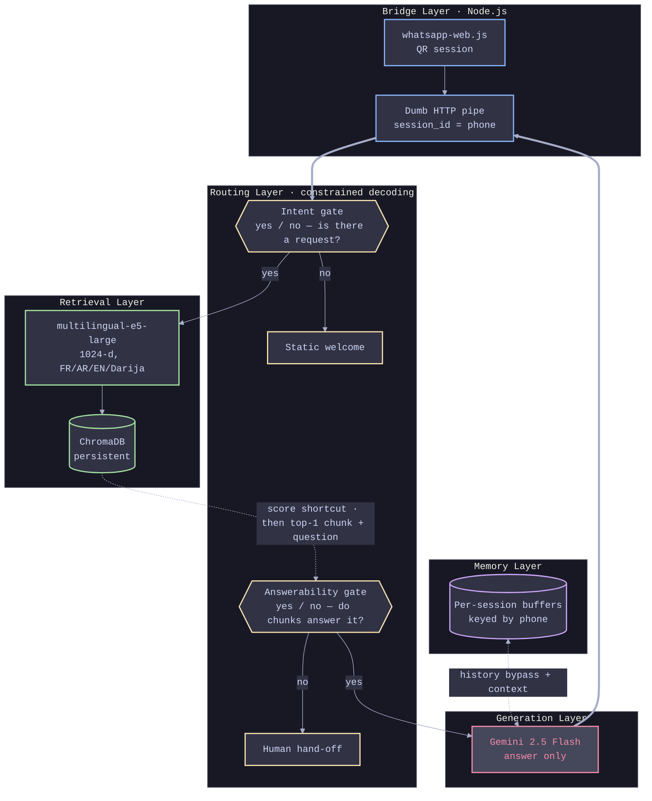

# Agency Brain

> A multilingual WhatsApp assistant for Moroccan study-abroad agencies. Its routing once rested on two brittle heuristics — a keyword regex and a single similarity score. I replaced both with **constrained-decoded classifiers** that always return a clean, structured decision, and kept Gemini for the one thing it's irreplaceable at: writing the answer.

*Built for the real workflow of a Moroccan study-abroad agency — students text in French, Arabic, and Darija, at all hours, and expect a human-quality answer.*

The interesting work here isn't the model. It's the **orchestration**: knowing which of many moving pieces — a WhatsApp bridge, two small local classifiers, a vector store, a hosted LLM, a memory buffer — should make each decision, and wiring them so the whole thing behaves predictably even when one piece misbehaves. This README walks that story from the plainest possible framing down to the measured numbers.

<!-- Hero stat cards (82%→89%, 50%, $0.00) and tag pills stay exactly as they are today — that part of your page already works well. -->

---

## The Problem {#the-problem}

A study-abroad agency in Morocco lives inside its WhatsApp inbox. Students fire off questions all day — *"chhal khasni nkhles bach n9ra f canada?"*, *"ما هي شروط الفيزا؟"*, *"bonjour, les universités disponibles au UK svp"* — three languages and one romanized street dialect (Darija) braided together in a single thread. Every unanswered message at 11pm is a lost client.

The naive build is one dumb pipe: forward every message to an LLM, return whatever comes back. It works in a demo and falls apart in production — you pay for a model call on *"salam"*, and you pay again when someone asks about the weather.

So the real problem here was never generation. It was **orchestration**: deciding — cheaply and *reliably* — which messages deserve an expensive answer and which can be handled for free, before a single dirham is spent.

And here's the honest part most people get backwards: in the original system, **the expensive model never made those decisions at all.** The routing rested on two cheap heuristics — a keyword regex to spot greetings, and a single cosine-similarity number to guess whether a question was in scope. Those two heuristics *were* the fragile part. This project is the story of replacing them with something trustworthy.

---

## In Plain Terms {#in-plain-terms}

A few words I'll use throughout, in plain language — keep this panel open alongside the rest of the page:

<Aside anchor="in-plain-terms" title="Terms used throughout">

- **Knowledge base (KB):** the agency's own documents — visa rules, tuition, university lists, deadlines. The assistant may answer *only* from these. It never invents facts.
- **In scope vs. out of scope:** a question is *in scope* if the KB actually contains the answer (*"what are the fees for Canada?"*). It's *out of scope* if it doesn't (*"what's the weather today?"*). Out-of-scope messages are politely handed to a human agent instead of guessed at.
- **The three lanes:** every message ends up in exactly one of three paths — a **greeting** (free canned welcome), an **out-of-scope** question (free, handed to a human), or an **answerable** question (the *only* path that pays for a Gemini call).
- **Routing:** deciding which lane a message belongs in. Most of this page is the story of making that one decision reliable.
- **Constrained decoding:** forcing a language model's output to fit a fixed shape — one of a set of labels, or a specific JSON schema — *at generation time*, so it is literally incapable of returning anything you can't act on. This is the technique that replaced the two heuristics.

</Aside>

---

## How It Works {#how-it-works}

The routing isn't one decision — it's **two small constrained classifiers** placed at the two forks that used to be guesswork, with a cheap embedding-score shortcut in front of the second one so it only runs when it's actually needed.

<Breakout anchor="how-it-works">

```
                         WhatsApp message
                                │
                                ▼
                   ┌────────────────────────┐
                   │   INTENT GATE  (yes/no) │   "ignoring any greeting,
                   │   constrained decoding  │    is there ALSO a request?"
                   └───────────┬─────────────┘   ← replaces the keyword regex
              no (pure greeting)│ yes (a real question is in there)
              ┌─────────────────┘                     │
              ▼                                        ▼
        ┌───────────┐                     ┌───────────────────────┐
        │  welcome  │                     │  retrieve top-K chunks │
        │  0 cost   │                     │  from the KB (e5-large)│
        └───────────┘                     └───────────┬───────────┘
                                                       ▼
                                     ┌─────────────────────────────────┐
                                     │  SCOPE GATE  (hybrid, 3 tiers)   │
                                     │  1. active session? → in scope   │
                                     │  2. top score ≥0.68 → in scope   │
                                     │     top score <0.60 → out        │
                                     │  3. gray band → ask the          │
                                     │     ANSWERABILITY classifier      │
                                     │     (constrained yes/no)          │  ← replaces the 0.66 threshold
                                     └───────┬──────────────────┬───────┘
                                    not answerable        answerable
                                    ┌────────┘                  │
                                    ▼                           ▼
                             ┌─────────────┐          ┌───────────────────┐
                             │  hand-off   │          │ Gemini writes the │
                             │ to a human  │          │  cited answer     │
                             │   0 cost    │          │ (user's language) │
                             └─────────────┘          └───────────────────┘
```

</Breakout>

**The Intent gate** runs first on the raw message. It doesn't pattern-match for greetings — it *decides*, in one constrained yes/no: *ignoring any greeting or thanks, does the message also ask for something?* A pure *"salam"* or *"chokran bzaf"* answers **no** and gets a free welcome. A greeting glued to a real question — *"salam, les universités au Canada?"* — answers **yes**, so the question underneath is never swallowed as smalltalk the way a regex would swallow it; it goes straight to the answer path.

**The Scope gate** is deliberately *not* one decision. Running a 1.5B model on every message is slow (~7s on CPU), and most messages don't need it — the retrieval score already screams the answer. So it's a three-tier funnel: an active conversation is trusted outright (so a bare follow-up like *"chhal taman?"* isn't rejected in isolation); a confidently high or low top-chunk score decides instantly; and **only the ambiguous middle band `[0.60, 0.68)` actually pays for the Answerability classifier**, which reads the question *and* the retrieved chunk together and judges whether the evidence really supports an answer. Only past all of that does Gemini get paid.

That "spend the expensive check only where the cheap signal is uncertain" instinct is the whole design philosophy in one gate.

---

## Architecture {#architecture}

I split the system into five boundaries, drawn on paper before any code. The point of the split is that **each layer makes exactly one kind of decision and hands a clean result to the next** — the bridge never reasons, the classifiers never generate, the generator never routes.

<Breakout anchor="architecture">



</Breakout>

<Aside anchor="architecture" title="Layer roles">

| Layer | Role | Mechanism |
|-------|------|-----------|
| Bridge | WhatsApp I/O, nothing else | `whatsapp-web.js` + HTTP, zero AI logic |
| Routing | The two decisions that used to be guesswork | `Qwen2.5-1.5B-Instruct` (local, CPU), output constrained via `outlines` |
| Retrieval | Find evidence across languages | `multilingual-e5-large` → ChromaDB, top-K + scores |
| Generation | Write the human-quality answer | Gemini 2.5 Flash, answerable lane only |
| Memory | Contextual follow-ups | per-phone `ChatMemoryBuffer` |

</Aside>

Each layer is one file (`classifiers.py`, `router.py`, `rag_engine.py`, `memory.py`, `api_server.py`), and the seams are strict on purpose — see `CLAUDE.md` for the module-by-module contract.

**Three decisions shaped this system, each chosen over the obvious alternative:**

**Two constrained classifiers over two heuristics.** The old routing was a keyword regex and a single cosine-similarity float — both cheap, both brittle. I replaced each with a small local model whose output is **mechanically constrained** — to a fixed label for the yes/no gates, and to a typed JSON object for richer tags — so the router receives a structured verdict it can *always* act on, never a hope. Crucially I did **not** reach for a big LLM as the judge: ask a general-purpose model "is this in scope, yes or no?" and it will eventually answer *"It depends what you mean by scope…"* and break the router. Small model, locked output, guaranteed-parseable decision.

**Retrieve-first over query-in-one-shot.** The original engine retrieved and generated in a single call — which meant the in-scope decision happened *after* I'd already paid for the answer. Backwards. I split the pipeline into `retrieve()` and `generate()` so the answerability check can read the actual evidence (the top chunk and its score) *before* anyone spends on generation. Evidence before spend.

**A dumb bridge over a smart one.** The Node.js edge could have held routing logic. Keeping it deliberately brainless — it only relays text and a `session_id` — means the entire intelligence of the system lives in one runtime: one place to reason about, one place to upgrade. The bridge's only job is to never lie to the student when the brain is down.

---

## The Hard Parts {#the-hard-parts}

You can't pipe a trilingual WhatsApp inbox into an LLM and hope. Four problems had to be solved on purpose.

### The Darija Wall {#darija-wall}

Off-the-shelf greeting detection assumes clean text in one language. Real messages are *"slm wach 3ndkom des bourses?"* — romanized Arabic with French loanwords and no diacritics. A keyword regex catches `salam` and misses `slm`; it spots *"la bas?"* never; and it can't tell a greeting glued to a real question (*"salam, les universités au Canada?"*) from a plain hello, so the question silently dies in the wrong lane.

The fix was to stop pattern-matching and start *deciding*. The intent classifier reads the whole message — dialect and all — and emits a constrained yes/no on the real question underneath: *is there a request here at all?* Because the decision is schema-locked, the greeting can never hide the question. In the benchmark, this is exactly the case the naive router loses and the classifier wins: *"salam, visa canada?"* → the regex calls it smalltalk and drops it; the classifier routes it to the answer lane.

### One Number Can't Carry a Decision {#one-number}

The old in-scope check was a single threshold: if the top chunk's cosine score cleared `0.66`, answer; otherwise hand off. One number deciding everything breaks in exactly the cases that matter — and the measured data shows *how* it breaks:

- *"ما هي الجامعات المتاحة في كندا؟"* ("which universities are available in Canada?") — a real, answerable question that the KB covers, but its embedding score lands at **0.618**, under 0.66, so the fixed threshold **wrongly rejects it**.
- *"ما هي الوثائق المطلوبة للتقديم؟"* ("what documents are required?") — same story, scores **0.634**, also wrongly handed off.

Both Arabic questions in the eval set fail this way — the score is depressed for cross-lingual retrieval (Arabic query, English docs) even when the meaning matches perfectly. And you can't just *lower* the threshold: the out-of-scope noise (*"what's the weather in Casablanca?"* at 0.624) sits right in the same band, so a lower cutoff would start letting junk through into paid answers. A single number genuinely cannot separate these.

The fix is a classifier that reads what the float can't: the question **and** the retrieved chunk together, then answers a constrained yes/no on whether the evidence actually supports the question. Because those two Arabic scores (0.618, 0.634) fall inside the gray band `[0.60, 0.68)`, the classifier is exactly what fires — and it recovers both. Semantic judgment where a raw score chokes; the cheap threshold everywhere else.

### The Follow-Up Paradox {#follow-up-paradox}

A student asks about Canada, gets an answer, then sends *"chhal taman?"* — "how much?". On its own that fragment is near-meaningless to a retriever; it scores low and a strict scope gate would reject a perfectly valid follow-up as out of scope.

The fix is session-aware routing. A memory buffer is keyed to the student's phone number, and when an active conversation exists, the scope gate trusts context outright (tier 1 of the funnel) — letting Gemini resolve "how much?" against the Canada thread it already remembers, instead of judging the fragment in isolation.

### Telling the Truth When the Brain Is Offline {#offline-brain}

Two runtimes, one machine: WhatsApp lives in Node, the intelligence lives in Python, and they talk over localhost HTTP. If the Python brain is restarting or down, a naive bridge hangs the chat or swallows the message — the student just sees silence and assumes they've been ignored.

So the bridge degrades loudly, not silently. Every call to the brain has a timeout, and a refused connection triggers a graceful, human-toned fallback in French (*"we're having a technical issue, try again shortly"*) instead of a frozen chat. The dumb pipe's one real responsibility is honesty.

---

## Does It Actually Work? {#results}

I built a reproducible benchmark (`benchmark.py` + `benchmark_structured.py`) over **28 hand-labeled messages** — 12 answerable, 10 smalltalk, 6 out-of-scope, spread across Darija (12), English (8), French (6), and Arabic (2) — and ran the exact same retrieval through both the old naive router and the constrained one. Everything below is measured, not claimed. Raw output lives in `results/`.

### Routing accuracy — where the classifier wins, and where it doesn't {#routing-accuracy}

The +7 points aren't spread evenly — they land precisely on the cases a fixed heuristic *structurally cannot* handle.

<Aside anchor="routing-accuracy" title="Routing accuracy — the numbers">

| Router | Overall accuracy |
|---|---|
| Naive (greeting regex + fixed 0.66 similarity threshold) | **82%** |
| Constrained-decoding classifiers | **89%** |

| By language | Naive | Constrained |
|---|---|---|
| Arabic | **0/2** | **2/2** |
| Darija | 9/12 | 9/12 |
| French | 6/6 | 6/6 |
| English | 8/8 | 8/8 |

| By lane | Naive | Constrained |
|---|---|---|
| answer | 9/12 | **12/12** |
| smalltalk | 8/10 | 8/10 |
| fallback | 6/6 | 5/6 |

</Aside>

The naive router gets **every answerable Arabic question wrong** (the 0.618 / 0.634 threshold problem above) and drops greetings-with-questions like *"salam, visa canada?"*. The classifier fixes all of those — it goes 12/12 on the answer lane. It's not free, though: it trades one fallback case for the gain (a Darija joke that it over-eagerly tries to answer), which is the honest cost of a model that reasons instead of matches.

### The real value of constrained decoding — and where it's a wash {#constrained-decoding-value}

This is the finding I care most about, because it's the one most write-ups get wrong.

On the **binary yes/no gates, constrained decoding shows no measurable advantage.** I ran the same prompts through the same model with and without constraints — a 1.5B instruct model, asked "answer yes or no," already answers cleanly. Constraining it changes nothing you can measure. The value there is a *guarantee* (no parser, no invalid label, holds under prompt changes) — not a delta.

**The delta appears the instant the decision has structure.** I gave both paths the identical instruction to tag a query as a typed `{country, topic}` JSON object, and only varied whether decoding was constrained to the schema.

<Aside anchor="constrained-decoding-value" title="Constrained vs. free decoding">

| Decoding (binary yes/no gate) | Valid output |
|---|---|
| Free (unconstrained) | 100% |
| Constrained | 100% |

| Decoding (structured `{country, topic}`) | Directly parseable (`json.loads`, no cleanup) | Schema-valid even after a lenient parser |
|---|---|---|
| Free (unconstrained) | **39%** | 93% |
| **Constrained** | **100%** | **100%** — no parser, no validation code |

</Aside>

Two concrete failure modes the constrained path makes impossible:

- **61% of free outputs wrapped the JSON in ` ```json ` markdown fences.** Without hand-written cleanup, only 39% of them are usable as-is.
- Even *after* a forgiving parser that strips fences and grabs the first `{...}`, free decoding still fails on **out-of-enum values it cannot repair** — it emitted `"Canada"` (wrong case) and `"Morocco"` (not a valid option at all). Constrained decoding cannot produce either.

> **The honest thesis:** constrained decoding's payoff isn't accuracy on trivial gates — it's that the moment your output has *structure*, it deletes an entire class of parse-and-validate bugs by construction. On a binary flag that's a nice guarantee; on a schema it's the difference between 39% and 100% usable.

### Latency & cost {#latency-cost}

<Aside anchor="latency-cost" title="Latency & cost">

| Metric | Value |
|---|---|
| Routing decision latency (CPU) | ~7.3s per decision |
| Routing cost per 1,000 messages — local classifier | **$0.00** (self-hosted) |
| Routing cost per 1,000 messages — if delegated to Gemini | ~$0.189 |
| Inbound traffic that never reaches Gemini generation | **50%** (smalltalk 30% + out-of-scope 20%) |

*Cost assumptions: Gemini 2.5 Flash at \$0.30/M input, \$2.50/M output; ~280 / ~480 input tokens per intent / scope decision; measured traffic mix. Latency is the raw CPU cost of the local judge — the price paid for keeping decisions at \$0 and on-box.*

</Aside>

---

## What I'd Do Differently {#roadmap}

- **Make the decision schemas pluggable.** Today the two gates emit fixed shapes; the `{country, topic}` tagger already proves the schema path works, so I'd declare all decisions as named schemas and add new ones (urgency, target country, lead temperature) without touching the generation path.
- **Fold the follow-up rule into the classifier.** The "active session → trust context" bypass is still a hand-written Python branch. The cleaner end state feeds conversation-state straight into the answerability classifier, so one constrained decision covers it.
- **Get the scope-gate latency down.** ~7s per gray-band decision on CPU is fine for a WhatsApp cadence but not great. A quantized model, batching, or a smaller distilled judge for the gate would cut it — the embedding shortcut already keeps most traffic away from it.
- **Promote logging from a JSONL file to a real store.** The async interaction log is fine for one machine; an agency running this for months wants it in SQLite or Airtable for actual lead analytics.

<Aside anchor="stack" title="Stack at a glance">

| | |
|---|---|
| Bridge | Node.js, `whatsapp-web.js`, axios |
| API / Orchestration | Python, FastAPI, uvicorn |
| Decision layer | Constrained decoding via `outlines` on `Qwen/Qwen2.5-1.5B-Instruct` (local, CPU) |
| Retrieval | LlamaIndex, ChromaDB (persistent) |
| Embeddings | `intfloat/multilingual-e5-large` (local, 1024-d) |
| Generation | Google Gemini 2.5 Flash (answer lane only) |
| Source | [GitHub](#) |

</Aside>
